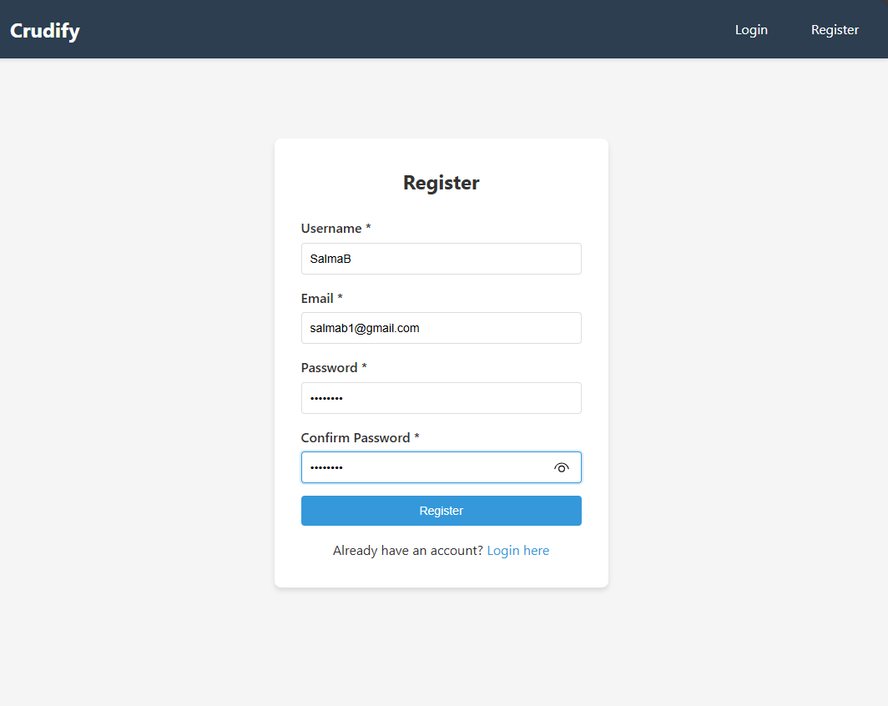
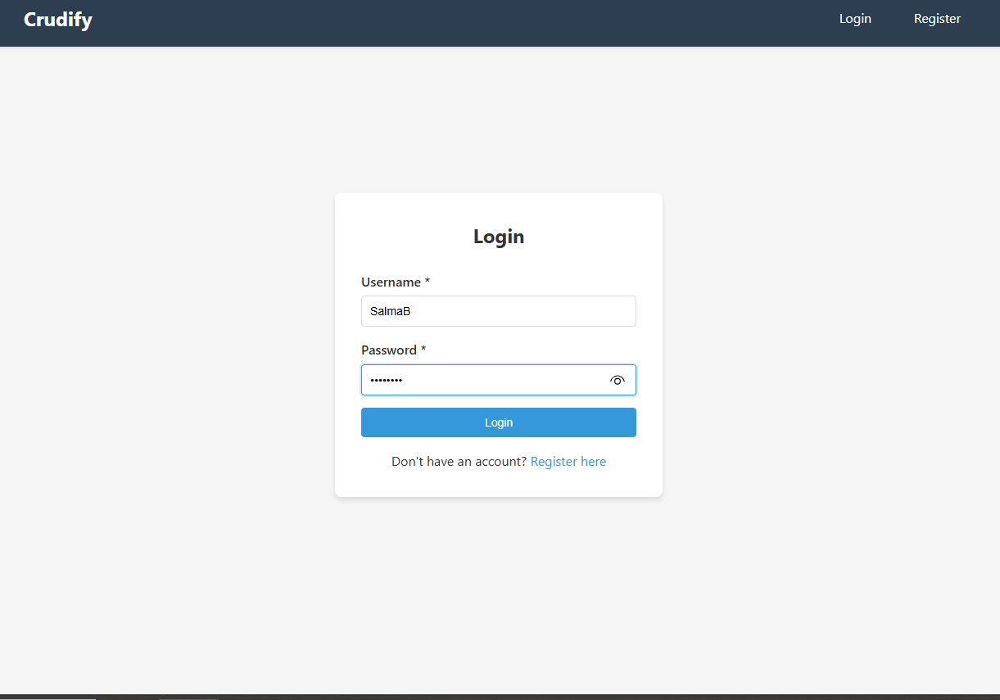
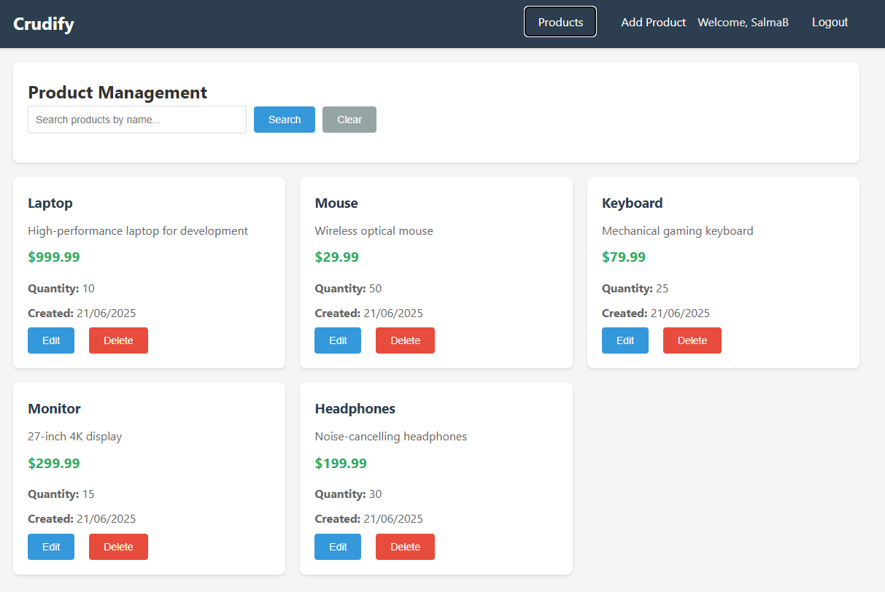
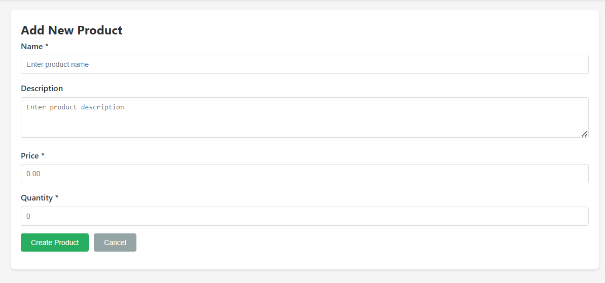
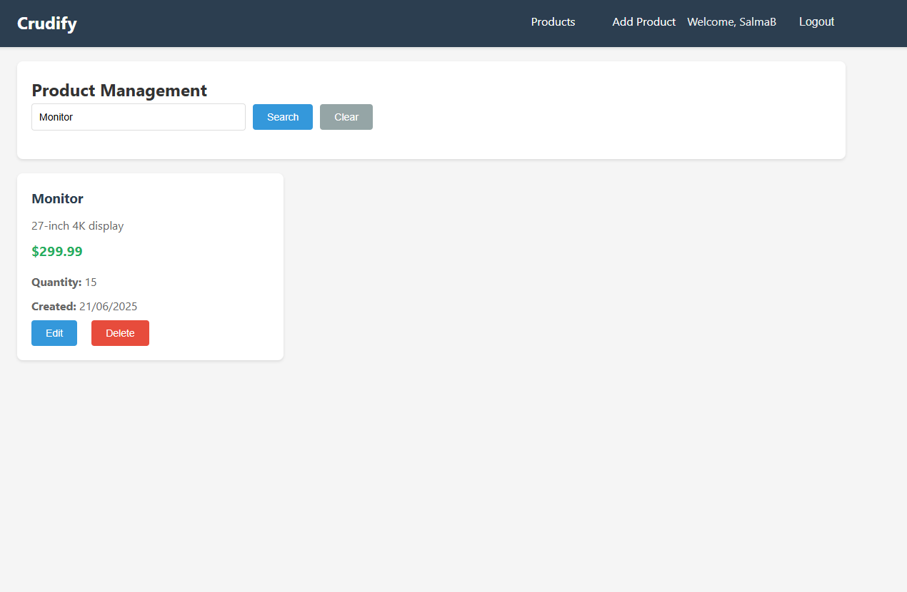
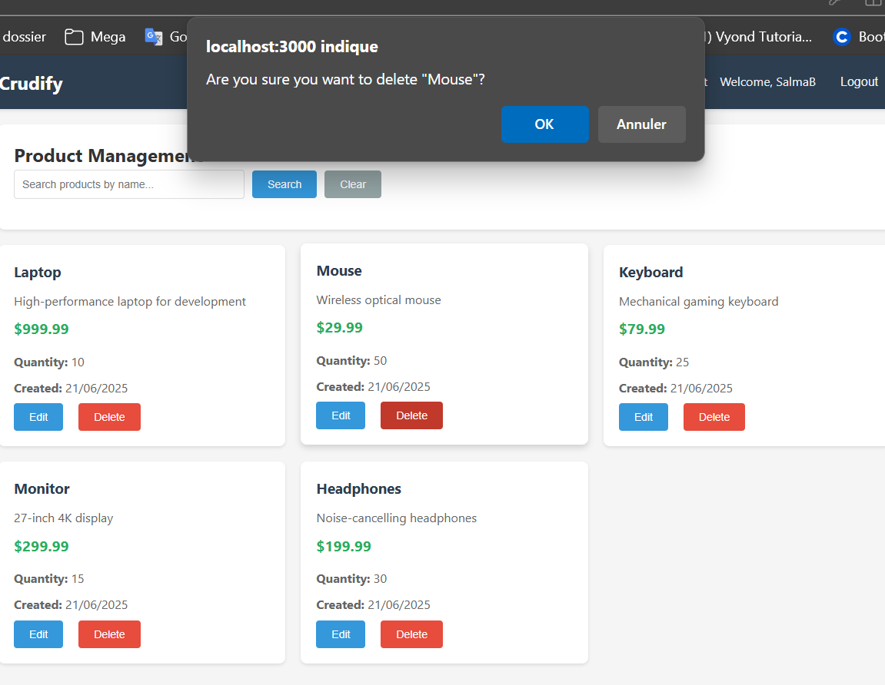
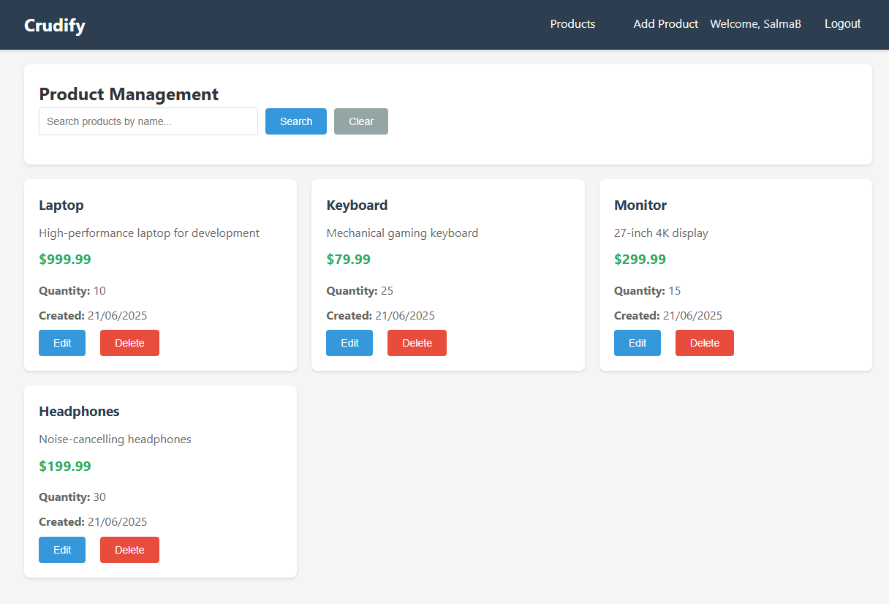

# Crudify - Full-Stack Product Management System

A modern full-stack CRUD application built with Spring Boot and React.

## Tech Stack

**Backend:** Java 17, Spring Boot 3.5.3, Spring Data JPA, PostgreSQL, Flyway, Maven  
**Frontend:** React 19.1.0, React Router DOM, Axios, Context API, Responsive CSS

## Authentication System

### User Registration
The application provides a comprehensive user registration system with the following features:
- **Username validation**: Minimum 3 characters, maximum 50 characters
- **Email validation**: Valid email format required with duplicate checking
- **Password security**: Minimum 6 characters with BCrypt encryption
- **Confirmation matching**: Password confirmation field ensures accuracy
- **Real-time validation**: Client-side validation with server-side verification
- **Error handling**: Clear error messages for validation failures and duplicate accounts

### User Login
The login system implements JWT-based authentication:
- **Secure authentication**: Username/password verification against encrypted database records
- **JWT token generation**: Stateless authentication with configurable expiration
- **Session management**: Automatic token storage and validation
- **Protected routes**: Access control for authenticated users only
- **Persistent sessions**: Token persistence across browser sessions
- **Error feedback**: Clear messaging for invalid credentials

### Security Features
- **Password encryption**: BCrypt hashing for secure password storage
- **JWT authentication**: Stateless token-based security
- **CORS configuration**: Production-ready cross-origin resource sharing
- **Route protection**: Frontend route guards for authenticated access
- **Session persistence**: Local storage management for user sessions

## Screenshots

### Authentication System
| Registration | Login |
|-------------|-------|
|  |  |

### Product Management Interface


### CRUD Operations
| Add Product | Search Products |
|------------|-----------------|
|  |  |

### Delete Confirmation
| Delete Dialog | Delete Process |
|--------------|----------------|
|  |  |

## Prerequisites

- Java 17+, Node.js 16+, PostgreSQL 12+, Git

## Quick Start

### 1. Database Setup
```sql
CREATE DATABASE crudify_db;
```

### 2. Backend Setup
```bash
cd crudify-server
mvnw.cmd spring-boot:run    # Windows
./mvnw spring-boot:run      # Linux/Mac
```
Backend runs on `http://localhost:8080`

### 3. Frontend Setup
```bash
cd crudify-client
npm install
npm start
```
Frontend runs on `http://localhost:3000`

## API Endpoints

### Authentication Endpoints
| Method | Endpoint | Description |
|--------|----------|-------------|
| POST | `/api/auth/register` | Create new user account |
| POST | `/api/auth/login` | Authenticate user credentials |

### Product Endpoints
| Method | Endpoint | Description |
|--------|----------|-------------|
| GET | `/api/products` | Get all products |
| POST | `/api/products` | Create product |
| PUT | `/api/products/{id}` | Update product |
| DELETE | `/api/products/{id}` | Delete product |
| GET | `/api/products/search?name={name}` | Search products |

## Features

**Authentication & Security:**
- JWT-based stateless authentication
- BCrypt password encryption
- Protected route system
- Session persistence
- Form validation with real-time feedback
- Duplicate username/email prevention

**Backend:** 
- RESTful API with full CRUD operations
- Input validation with custom error messages
- Global exception handling with structured responses
- Database migrations with Flyway
- CORS configuration for frontend integration
- Security configuration for development

**Frontend:** 
- Responsive grid layout with modern CSS
- Real-time CRUD operations with instant updates
- Search functionality with case-insensitive filtering
- Form validation with client-side feedback
- Loading states and error handling
- Context API state management with useReducer

**Additional Features:**
- Sample data seeding for testing
- Search by product name
- Delete confirmation dialogs
- Responsive design for mobile devices
- Clean separation of concerns architecture

## Testing

1. Test API: `curl http://localhost:8080/api/products`
2. Test UI: Open `http://localhost:3000` and test CRUD operations
3. Test Registration: Create new account via registration form
4. Test Authentication: Login with registered credentials

## Troubleshooting

- **Java not found**: Install Java 17 and set JAVA_HOME
- **Database error**: Check PostgreSQL service and credentials in `application.properties`
- **Port conflicts**: Stop services on ports 8080/3000
- **Authentication issues**: Clear browser local storage and retry login 